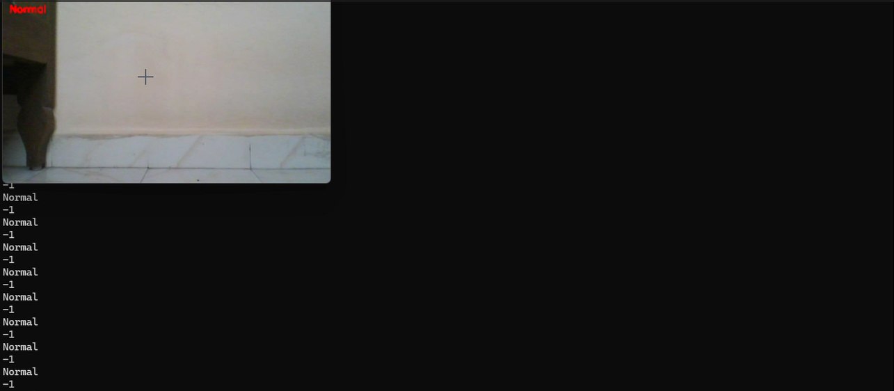

# Motion Detection Using Python & OpenCV

## Overview
This project detects moving objects in real time using a webcam. It uses frame differencing, thresholding, and contour detection techniques provided by OpenCV.

## Features
- Real-time motion detection
- Bounding boxes around moving objects
- Simple and lightweight implementation

## Technologies Used
- Python
- OpenCV
- NumPy

## How to Run
1. Install Python
2. Install the required packages:
     pip install -r requirements.txt
4. Run:
   python cv1.py

## Demo

## Screenshots
### Initial Frame

### Motion Detected

### Code page

## Author

**Devipriya B**

- Bachelor of Engineering (Computer Science and Engineering).
- Passionate about Python, Computer Vision, Full-Stack Development and AI Engineer.

- GitHub: [github-Devipriya B](https://github.com/devinish07-coder)
- LinkedIn: [LinkedIn-Devipriya B](https://www.linkedin.com/in/devipriyab07)

## ⭐ If you found this project useful, consider giving it a star!
